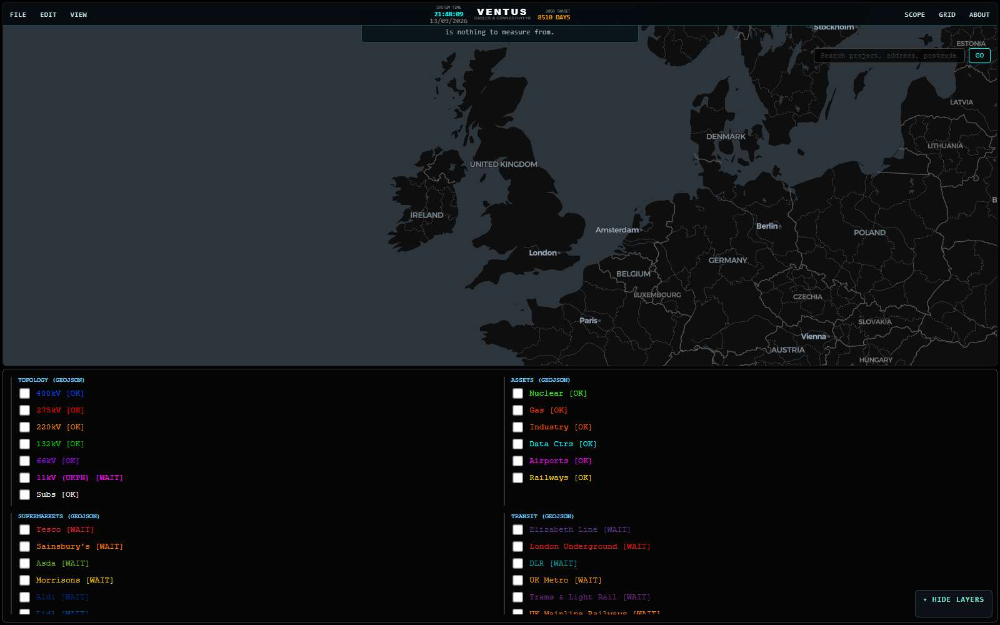

# GREEN · drive · hello-from-the-msi

Order: `inbox/202609132150-hello-from-the-msi.md` — *First note, written by the machine to prove the loop: drive the live composition as published.*
Composition: `bench-202609132047` · loaded: streaming-parquet-bridge, uk-gazetteer-flyto, substation-intelligence, sld-sandbox

Load 12941 ms · router composed · layers 12 OK / 48 WAIT · canvases 1

## Health
- 🟢 **streaming-parquet-bridge** (0)
- 🟢 **uk-gazetteer-flyto** (0)
- 🟢 **substation-intelligence** (0)
- 🟢 **sld-sandbox** (0)
- 🟢 **shell** (0)
- 🟢 **loader** (0)
- 🟢 **vendor** (0)
- 🟢 **other** (0)
- 🟢 **unattributed** (0)

## Findings
- none

_MSI · RTX 5070 Ti · bench run 20260913T204809_
